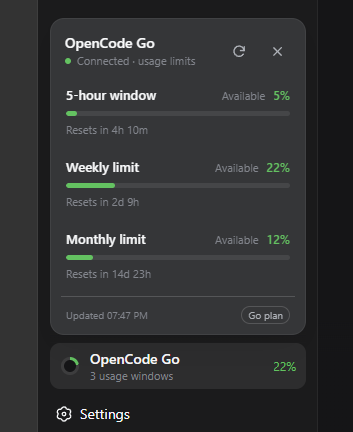
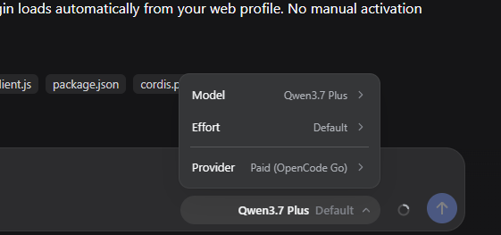

# DSH OpenCode Bridge

[](https://github.com/Vansh-Bhardwaj/dsh-opencode-bridge/actions/workflows/ci.yml)
[](https://github.com/Vansh-Bhardwaj/dsh-opencode-bridge/actions/workflows/codeql.yml)
[](LICENSE)

An independent companion plugin that makes OpenCode Go and Zen feel native inside [DeepSeek Harness](https://github.com/deepseek-ai/deepseek-harness).

It replaces the rough provider controls with an integrated model picker, adds a real usage dashboard, keeps the model catalog current, and lets text-only models work in image conversations through an automatic vision worker. Version 2 also adds recovery guards, append-only message versions, and an authenticated local-network mobile remote.

> [!IMPORTANT]
> This is a community project. It is not affiliated with or endorsed by DeepSeek or OpenCode.

## Preview

| OpenCode Go usage | Integrated model picker |
| --- | --- |
|  |  |

## What it adds

- A native-looking OpenCode Go sidebar with rolling, weekly, and monthly usage windows.
- An integrated model picker grouped by provider and model family.
- Live discovery of OpenCode Go and Zen models, including capability and context metadata.
- Automatic catalog refresh at startup and every 15 minutes, with last-known-good fallback.
- Native image handling when the selected model supports vision.
- Automatic delegation to an available vision model when a text-only model calls `read_image`.
- Preserved image descriptions when switching an existing image chat to a text-only model.
- DeepSeek V4 Flash Vision Exp preference when it is available in OpenCode Go.
- Direct DeepSeek API, DeepSeek web search, and bundled web tooling disabled by default.
- Bounded automatic recovery for DSH's `PI_AI_ERROR / network_error` failure.
- Guarded file edits: outside-workspace mutations are blocked, repeated no-op edits are absorbed, and stale edit failures include a fresh exact excerpt.
- Inline editing and an append-only branch timeline for previous messages.
- A phone-ready LAN gateway that proxies the complete DSH app, including streaming WebSockets.

## How vision routing works

```text
Image request
    |
    +-- selected model supports images --> use it directly
    |
    `-- selected model is text-only ------> vision worker describes the image
                                                |
                                                `--> description returns to the main chat
```

The worker is chosen from the current OpenCode catalog instead of a hard-coded capability guess. This means a model can remain selectable even after images have appeared in the conversation.

## Requirements

- Windows with PowerShell 7.
- DeepSeek Harness (`@deepseek-ai/dsh`), tested with `0.1.1-rc.2`.
- An OpenCode Go credential stored in DSH as `OPENCODE_GO_API_KEY`.
- Python 3 for model-catalog synchronization. Codex's bundled Python is detected when available.

## Install

```powershell
git clone https://github.com/Vansh-Bhardwaj/dsh-opencode-bridge.git
cd dsh-opencode-bridge
./install.ps1
dsh web
```

The installer:

1. Backs up an existing local OCUI plugin.
2. Copies this plugin and its catalog synchronizer into `~/.dsh`.
3. Enables the plugin in the DSH web profile.
4. Disables direct DeepSeek API and bundled DeepSeek web tools by default.
5. Installs the audited, pinned append-only conversation-history bundle.

To retain those DeepSeek services:

```powershell
./install.ps1 -KeepDeepSeekApi
```

### One-click Windows launcher

Create Desktop and Start-menu shortcuts that open DSH Web without a visible terminal:

```powershell
./launcher/Install-DSHWebShortcut.ps1
```

Use a custom icon (it is copied into the launcher install directory and reused on later reinstalls):

```powershell
./launcher/Install-DSHWebShortcut.ps1 -IconPath 'C:\path\to\deepseek.ico'
```

The shortcut reuses an existing server on port `3080`. Otherwise it starts `dsh web --no-open` in a hidden process, waits for the local server, and opens the default browser. Startup diagnostics are written to `~/.dsh/logs/`.

It also installs **Harness Remote Access** in the Start menu. That entry chooses the private address on Windows' preferred default route and presents one locally generated QR code plus one copyable fallback link. Scan it from a phone connected to the same router, then add Harness to the phone's home screen. The phone receives the full DSH surface—sessions, live output, composer, message editing and branches, models, permissions, goals, and usage—not a separate dashboard. On phones, **Chats** opens the workspace and session drawer; selecting a chat returns to the conversation. The phone header follows the current task, exposes running state and a new-session action, reports connection loss, and adapts the composer to the software keyboard. Long conversations use rendering containment to stay responsive. The QR code is generated in your browser and the pairing token is never sent to a third-party QR service.

DSH itself remains bound to `127.0.0.1:3080`. The gateway binds loopback plus the preferred private IPv4 default-route interface, authenticates HTTP and WebSocket requests, uses signed HttpOnly/SameSite sessions, rate-limits failed pairing, and persists only random authorized-device IDs. It is intentionally LAN-only; there is no Tailscale or public relay.

## Verify

```powershell
node --check ./plugin/lib/index.js
node --check ./plugin/lib/client.js
node --test
python ./scripts/sync-dsh-models.py --dry-run
dsh web
```

In DSH Web, check that:

- The sidebar shows all three OpenCode Go usage windows.
- The picker lists current Go and Zen models.
- A vision model can call `read_image` directly.
- A text-only model can call `read_image` through the vision worker.
- An image chat can switch to a text-only model and continue with preserved visual context.

## Network and privacy

| Destination | Data sent | Purpose |
| --- | --- | --- |
| `opencode.ai` | OpenCode credential, prompts, and attached images when an OpenCode model is used | Model inference, usage limits, and catalog discovery |
| `models.dev` | Public model identifiers only | Supplemental model capability metadata |

The LAN gateway does not send remote-access traffic to a third party. Its default transport is HTTP for zero-setup use on a trusted home LAN; do not use it on public or hostile Wi-Fi. Pairing authentication prevents unsolicited access but does not replace transport encryption against an on-path LAN attacker.

Credentials, DSH settings, model caches, sessions, and personal paths are never included in this repository. The plugin does not add telemetry.

## Repository layout

```text
plugin/
  lib/index.js       Backend integration, discovery, usage, and vision routing
  lib/resilience.js  Network retry, workspace guard, and edit recovery
  lib/client.js      Sidebar usage panel and model picker UI
  package.json
gateway/             Authenticated LAN proxy and responsive mobile shell
vendor/              Audited pinned append-only conversation history plugin
launcher/            Hidden launcher and Desktop/Start-menu installer
scripts/
  sync-dsh-models.py Atomic OpenCode catalog synchronizer
install.ps1          Idempotent plugin and conversation-history installer
```

## Security

CI validates JavaScript syntax, Python compilation, PowerShell parsing, and an isolated installer run. CodeQL scans JavaScript and Python on every push and pull request. See [SECURITY.md](SECURITY.md) for responsible disclosure.

## Contributing

Bug reports and focused pull requests are welcome. See [CONTRIBUTING.md](CONTRIBUTING.md).

## License

[MIT](LICENSE)
